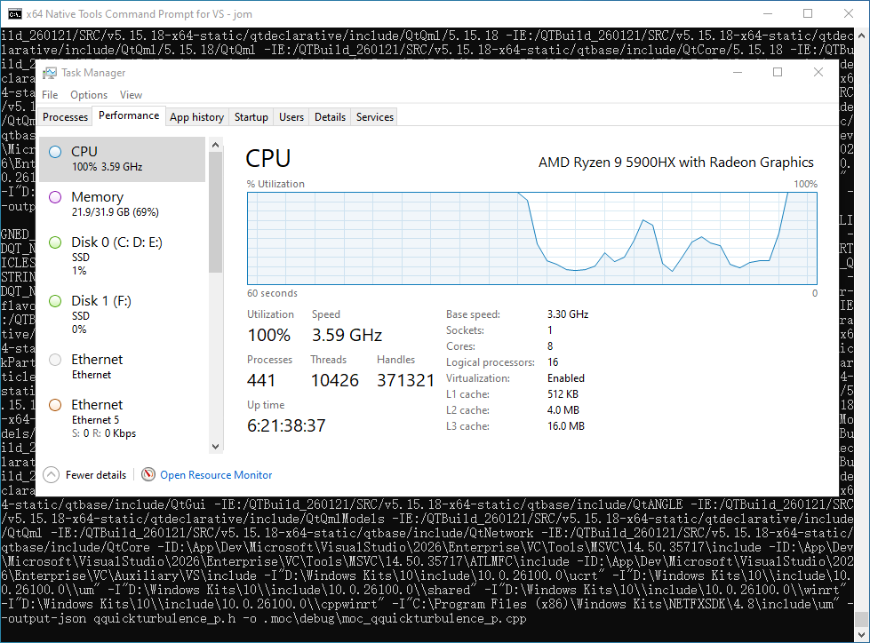


用 Visual Studio 2026 编译和使用 QT 5.15.18
===========================================

前言
----

自从 2020 年 3 月 31 日发布 QT 5.14.2 之后，QT 不再向开源社区版用户提供二进制安装包。尽管通过在线安装的方式仍然可以获得后续开源社区版的 QT，但很多军工行业用户从此 QT 的版本永远定格在了 5.14.2，因为他们的很多计算机是不连接互联网的。

实际上 QT 的源代码是很好编译的，本文对此进行了示范。

军工行业用户多选择 QT5 而非 QT6，因为 QT5 兼容 Windows 7 操作系统，而 QT6 不再兼容 Windows 7。QT5 的最后一个 Release 版本是 QT 5.15.18，因此本文就编译 5.15.18 这个版本的源代码，QT5 的其它版本编译方法是一样的。QT6 的编译方法其实也相差不大。

本文的目标
~~~~~~~~~~

#. 采用 Visual Studio 2026 编译 QT 5.15.18 开源社区版的源代码。
#. 分别编译 QT 的动态链接库和静态库。
#. 目标平台为 Windows。

编译QT5动态链接库与静态库
-------------------------

准备工作
~~~~~~~~

下载QT5源代码
^^^^^^^^^^^^^

QT 官方网站上的开源代码入口地址是：`Qt Downloads <https://download.qt.io/>`_ ，从中找到并下载QT 5.15.18 开源社区版的源代码： `qt-everywhere-opensource-src-5.15.18.zip <https://download.qt.io/archive/qt/5.15/5.15.18/single/qt-everywhere-opensource-src-5.15.18.zip>`_

安装必需的软件
^^^^^^^^^^^^^^

将下载到的 `qt-everywhere-opensource-src-5.15.18.zip <https://download.qt.io/archive/qt/5.15/5.15.18/single/qt-everywhere-opensource-src-5.15.18.zip>`_ 解压，在源代码根目录的 README 文件中可以看到编译该源代码的系统要求：

::

   System requirements
   ------------------

    - Perl 5.8 or later
    - Python 2.7 or later
    - C++ compiler supporting the C++11 standard

根据上面的要求，安装下列软件：

#. Visual Studio 2026（包含 C++ 桌面开发的Workload）
#. Perl v5.38.2 (当前最新版)。注意在 Windows 平台，Perl 有 ActivePerl 和 Strawberry Perl 这两种选择，推荐 Strawberry Perl；
#. Python 3.14.0 (当前最新版)

安装 Jom 以加速编译过程
^^^^^^^^^^^^^^^^^^^^^^^

然后，为了获得最大的编译速度，务必安装 `jom <https://wiki.qt.io/Jom>`_ 。 `jom <https://wiki.qt.io/Jom>`_ 的作用是充分利用现代计算机的多核，加快编译速度。

其实你不安装 Jom 也行，后面的编译过程你用 nmake 就行，但是那样的话速度会明显慢很多。

实用工具：快速拷贝文件 ChoEasyCopy
^^^^^^^^^^^^^^^^^^^^^^^^^^^^^^^^^^

在实际操作中，折腾 QT 的编译过程，不可避免地要多次拷贝解压出来的源代码，这个文件夹挺大的，里面碎片文件特别多，用 Windows 系统默认的拷贝功能，时间非常长。而且令我很崩溃的是，在一次拷贝的过程中，遇到了文件路径超出最大限制（就是 C/C++ 编程里面的 MAX_PATH 宏定义）的问题导致个别文件拷贝失败，如果单独找出这些拷贝失败的文件来又非常麻烦。

所以我搜索快速拷贝工具。一开始是想找 Robocopy GUI 这样的工具，但我很快发现了另一个更好用的工具： `ChoEasyCopy <https://github.com/Cinchoo/ChoEazyCopy>`_ 。关于这个工具软件的介绍请看： `ChoEazyCopy, Yet Another RoboCopy GUI <https://cinchoo.medium.com/eazycopy-yet-another-robocopy-gui-96b2713bf324>`_

推荐从以下地址下载该软件：

+ https://github.com/Cinchoo/ChoEazyCopy 
+ https://sourceforge.net/projects/eazycopy-a-robocopy-gui/ 

动态编译QT5源代码
~~~~~~~~~~~~~~~~~

配置编译参数
^^^^^^^^^^^^

打开 `x64 Native Tools Command Prompt for VS 2026` 和 `x86 Native Tools Command Prompt for VS 2026` 分别用于编译 64 位和 32 位 QT5 动态链接库。

::

    .\configure.bat -opensource -confirm-license -debug-and-release -prefix "E:\QTBuild_260121\OUT\Qt5.15.18\VC2026-x64-Shared" -platform win32-msvc -qt-sqlite -qt-pcre -qt-zlib -qt-libpng -qt-libjpeg -qt-freetype -qt-harfbuzz -opengl dynamic -skip qtwebengine -skip wayland -skip purchasing -skip qtspeech -skip qtdoc -nomake tests -nomake examples -optimize-size -strip -c++std c++17 -mp

编译和安装
^^^^^^^^^^

::

    jom -j16
    jom install

编译的过程是非常耗时的，有些人在 ``jom `` 这一步耗费了三、四个小时的时间。这项工作需要强大的多核处理器，并且需要硬盘的 I/O 性能尽可能好。我选用了手头CPU最强劲的移动工作站。如 :numref:`fig_260121_Compile` 所示，CPU 利用率非常高，只用了 40 分钟左右就完成了编译。

    编译 QT5 源代码

静态编译QT5源代码
~~~~~~~~~~~~~~~~~

修改 msvc-desktop.conf
^^^^^^^^^^^^^^^^^^^^^^

配置编译参数
^^^^^^^^^^^^

打开 `x64 Native Tools Command Prompt for VS 2026` 和 `x86 Native Tools Command Prompt for VS 2026` 分别用于编译 64 位和 32 位 QT5 静态库。

::

    .\configure.bat -static -opensource -confirm-license -debug-and-release -prefix "E:\QTBuild_260121\OUT\Qt5.15.18\VC2026-x64-Static" -platform win32-msvc -qt-sqlite -qt-pcre -qt-zlib -qt-libpng -qt-libjpeg -qt-freetype -qt-harfbuzz -opengl dynamic -skip qtwebengine -skip wayland -skip purchasing -skip qtspeech -skip qtdoc -nomake tests -nomake examples -optimize-size -strip -c++std c++17 -mp

编译和安装
^^^^^^^^^^

::

    jom -j16
    jom install

