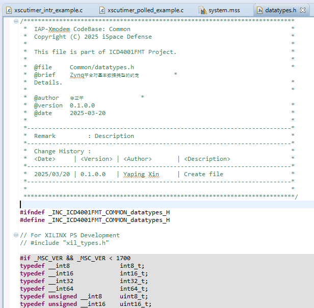
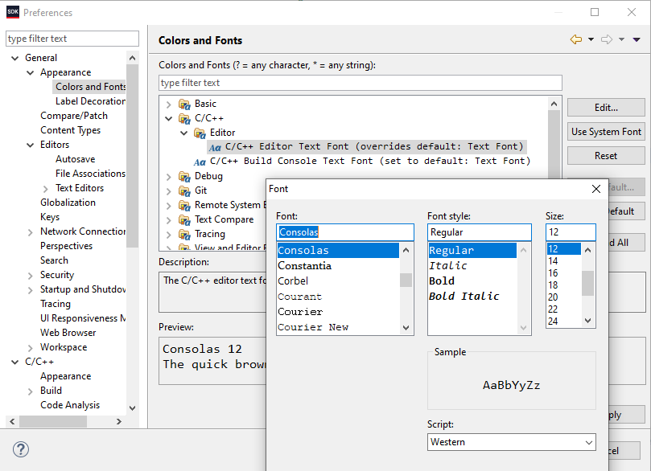
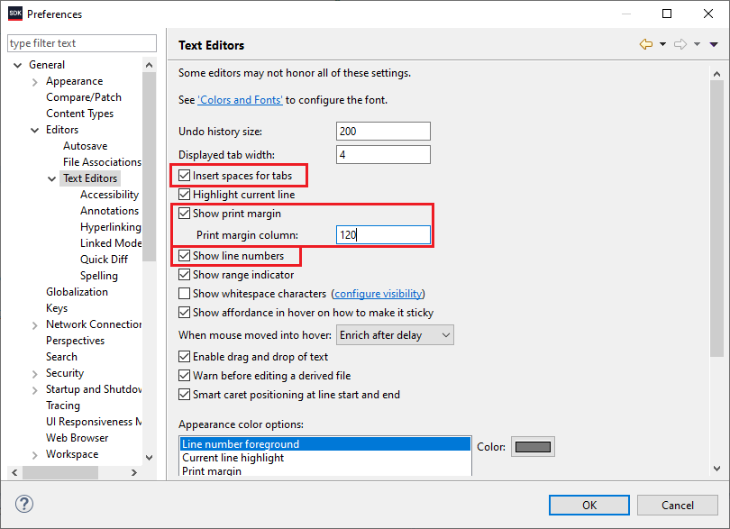
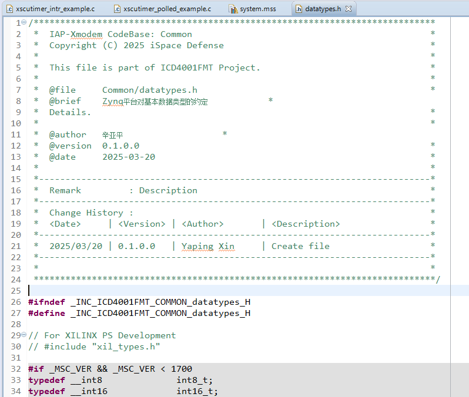


Vivado SDK 2018.3 源代码显示设置
================================

问题
----

在 Vivado SDK 2018.3 中显示源代码，默认的效果如 :numref:`fig_260311_Default` 所示：

    Vivado SDK 2018.3 默认的源代码显示效果

这个显示效果有2个主要问题：

#. 中文太小，基本不可读；
#. 源代码没有行号显示；

另外，我还希望：

#. 以空格代替制表符(Tab)；
#. 在第120字符处显示一条淡淡的竖线，提示我打印边界，以使我对过长的代码主动进行一点调整。

配置
----

为了改善上述问题，在 SDK 菜单 Windows | Preference 中进行设置，如 :numref:`fig_260311_setfont` 和 :numref:`fig_260311_set_linenumber_tab_printmargin` 所示：

    设置源代码的默认字体和大小

    设置源代码显示行号、用空格代替制表符、显示打印边界

经过上述设置，源代码显示效果如 :numref:`fig_260311_effects` 所示。

    设置后的源代码显示效果

达到了设置的目的。
